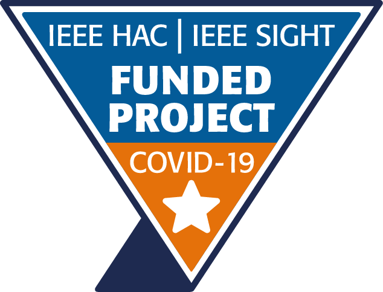
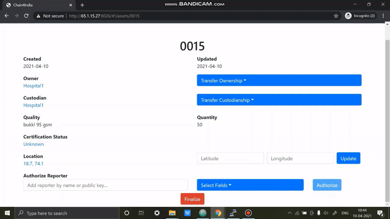
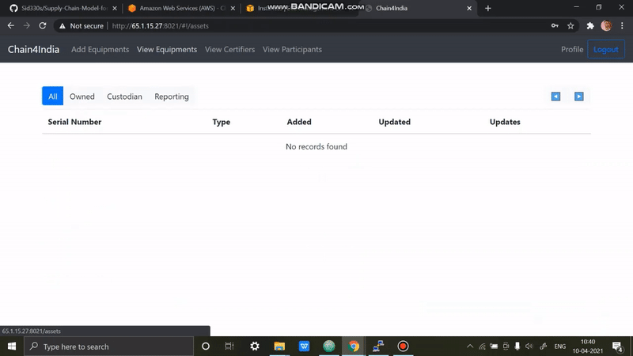
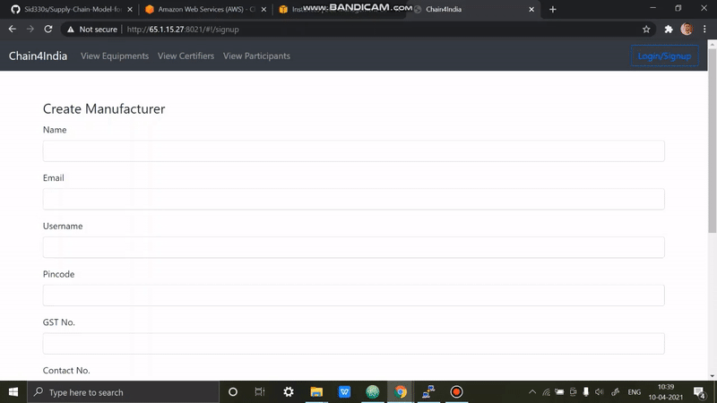

# Chain4India: Supply Chain Management for Medical Equipments

## Project Details

- **List of HAC funded projects**: [view](https://docs.google.com/spreadsheets/d/e/2PACX-1vTey3YTuoUi49Eijyf3Yl-FoyhCkaVwslK9zQRcgCQqOZu1XrjLiqEy-5qUQ17vNOTzuWzM7K0Qsd9v/pubhtml)

```
Project Name: Blockchain Using Hyperledger Sawtooth to Combat COVID-19
Project Number: 20-COV-047
Funding Organization:
  IEEE Humanitarian Activities Committee (HAC) &
  IEEE Special Interest Group on Humanitarian Technology (SIGHT)
```

|   |   |    |
|-----------------------|----------------------|----------------------|


## Problem Statement

Substandard quality medical equipment (e.g., masks and PPE kits) are being manufactured and sold at very low prices, compromising safety and quality. These subpar products can harm patients, medical staff, and the reputations of hospitals. The challenges include:

1. **Traceability:** Difficulty in tracking the manufacturing source and distribution path of the equipment.
2. **Trust:** Ensuring that medical equipment is of good quality and certified.
3. **Transparency:** Verifying if the equipment is priced appropriately.

## Proposed Solution

We propose a blockchain-based solution using the Hyperledger Sawtooth platform. This approach establishes a distributed ledger network between multiple nodes, ensuring:

- **Traceability:** Detailed tracking of equipment manufacturing and distribution.
- **Trust:** Assurance of quality and certification.
- **Transparency:** Clear pricing and transaction records.

## Key Features

1. **Equipment Details and Tracking:** Hospitals and all parties in the supply chain can view complete information about medical equipment.
   
   

   
   
2. **Registration and Authentication:** Includes profile management for all participants in the network for secure access.
   
   
   
3. **Secure Equipment Transfer:** Streamlined transfer process between participants.
   
   

## Components

The solution uses the core components of Hyperledger Sawtooth, with additional elements to customize blockchain and user interaction:

- **Transaction Processor:** Handles supply chain transaction logic.
- **Server:** Provides an HTTP/JSON API for supply chain actions.
- **Ledger Sync:** Synchronizes blockchain data to a local database.
- **Shell:** Contains dependencies to run commands and scripts.

## Setup and Deployment

Follow this [GitHub guide](https://github.com/soumilshah1995/Deploy-Docker-Container-on-AWS) and [video tutorial](https://www.youtube.com/watch?v=awFLzy0XwXo) to deploy Docker containers on AWS EC2 or any machine.

This project uses Docker to simplify dependencies and deployment. Follow the instructions below:

### Prerequisites

- Install Docker and Docker Compose as per your operating system.

### Start-Up

Run the required Docker containers to start the system. The following services will be available:

- **Supply Chain REST API:** `http://localhost:8020`
- **Hospital Client:** `http://localhost:8026`
- **Manufacturer Client:** `http://localhost:8021`
- **Certifying Client:** `http://localhost:8025`
- **RethinkDB Admin Panel:** `http://localhost:8023`
- **Sawtooth Blockchain REST API:** `http://localhost:8024`

## Additional Resources

- **Video Demo:** [View here](https://drive.google.com/file/d/10i2ANKeOK4_X1tXVJqlB94gqu4KZKW6C/view?usp=sharing)
- **Presentation:** [Download here](https://he-s3.s3.ap-southeast-1.amazonaws.com/media/sprint/rakathon-2021/team/984273/cb0d4c1rakathon.pptx)