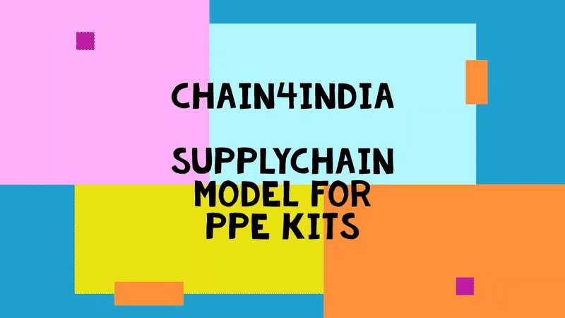
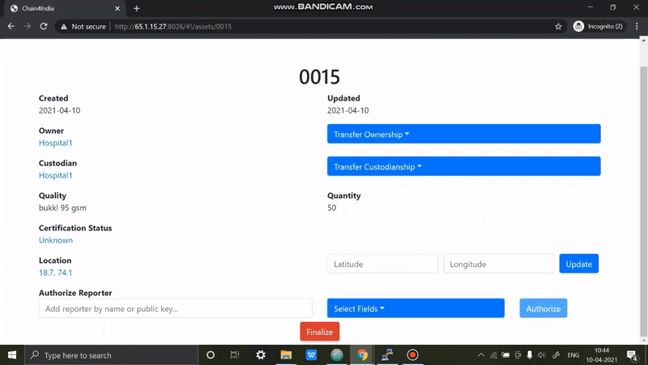
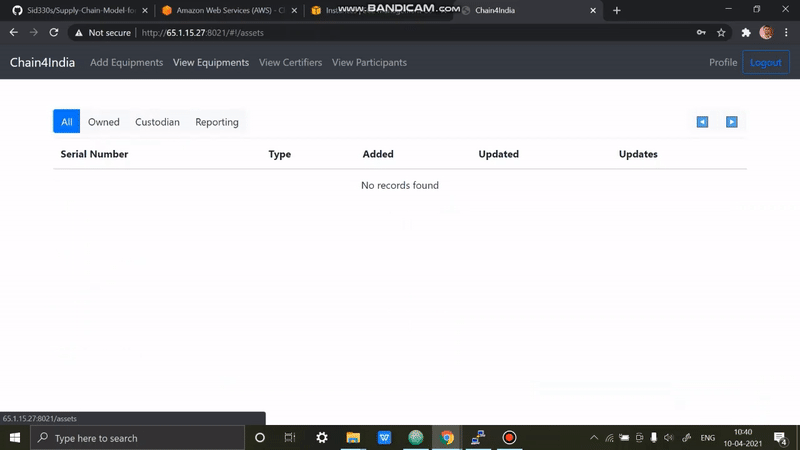
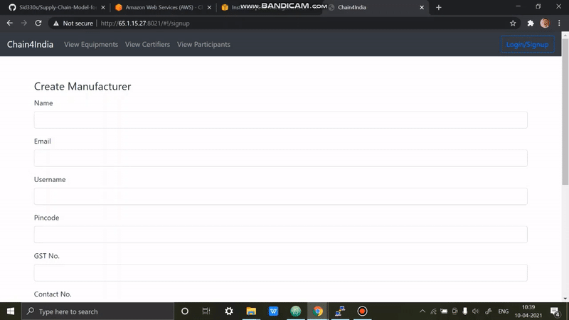
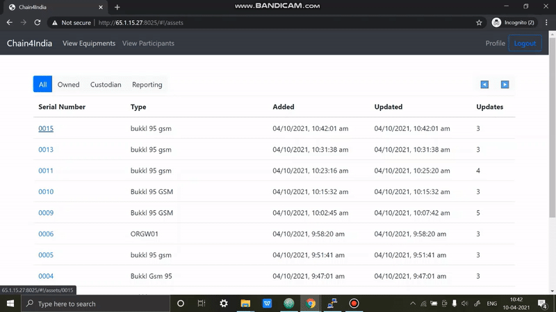

## Problem Statement:

Substandard Quality Medical Equipment ( Masks and PPE kits) are manufactured 
and sold in the market at very cheap prices that are not safe. 
When these equipment reach hospitals they have to be Of Good Quality and Certified 
as they may hurt Patients As Well As Doctors and Hospital reputations. 
But it is difficult for hospitals to track i.e : 

- a **problem of traceability :** Where they were manufactured , How did it get there?
- a **problem of Trust :** Is it Good Quality Medical Equipment? 
- a **Transparency :** Am I buying the equipment at an appropriate price ? 

We are providing a Blockchain based solution using Hyperledger Sawtooth Platform. 
We will be able to establish a network between multiple nodes i.e. distributed ledger using Hyperledger Sawtooth Platform.

**Hospitals as well as all the parties involved in Supply Chain are able to view all equipments and their details.**

**Built trust in this system using Blockchain Technology.**

**Requirement for Registration and Authentication (Includes Profile Management).**

**Transfer of Equipment from one participant to another.**

## How To setup on AWS 

https://github.com/soumilshah1995/Deploy-Docker-Container-on-AWS

https://www.youtube.com/watch?v=awFLzy0XwXo

## Video
https://drive.google.com/file/d/10i2ANKeOK4_X1tXVJqlB94gqu4KZKW6C/view?usp=sharing

## Presentation
https://he-s3.s3.ap-southeast-1.amazonaws.com/media/sprint/rakathon-2021/team/984273/cb0d4c1rakathon.pptx

## Demo
https://vibrant-heyrovsky-5625d7.netlify.app/chain4india.html

## Components

Running alongside the core components from Hyperledger Sawtooth, Supply Chain
includes a number of elements customizing the blockchain and user interaction
with it:

- a **transaction processor** which handles Supply Chain transaction logic
- a **server** which provides an HTTP/JSON API for Supply Chain actions
- a **ledger sync** which syncs blockchain data to a local database
- a **shell** container with the dependencies to run any commands and scripts

## Usage

This project utilizes [Docker](https://www.docker.com/what-docker) to simplify
dependencies and deployment. After cloning this repo, follow the instructions
specific to your OS to install and run whatever components are required to use
`docker` and `docker-compose` from your command line. This is only dependency
required to run Supply Chain components.

### Start Up

- The Supply Chain REST API will be at **http://localhost:8020**
- Hospital Client will be at **http://localhost:8026**
- Manufacturer Client will be at **http://localhost:8021**
- Certifying Client will be at **http://localhost:8025**
- RethinkDB's admin panel will be available at **http://localhost:8023**
- Sawtooth's blockchain REST API will be available at **http://localhost:8024**

